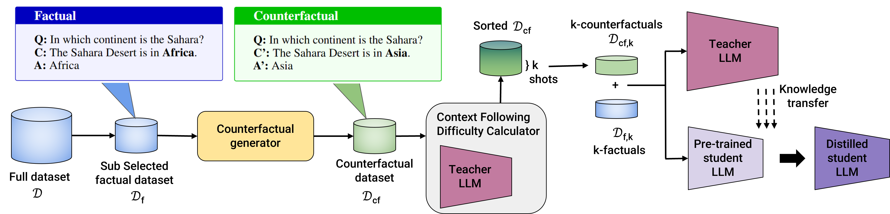

# COFFEQA: Counterfactual-guided Few-shot Distillation in Open-book Question Answering

<!-- TODO: swap in real badges once you have them -->
[](#)

Official implementation of **COFFEQA**, a counterfactual-guided strategy for
few-shot knowledge distillation in open-book question answering.

**Authors:** Kavinda Kehelella, Sanghamitra Dutta

> **Status:** Manuscript under review. <!-- TODO: update once a decision comes back, and add the arXiv/OpenReview link above -->

---

## Overview

Knowledge distillation trains a smaller student model to mimic a larger teacher
model for resource-constrained environments, but the process is typically
data-intensive and computationally expensive — particularly for generative
tasks. **COFFEQA** (**Co**unter**f**actual-guided **Fe**w-shot distillation in
open-book **Q**uestion **A**nswering) addresses this by selecting counterfactual
examples for data-efficient distillation.

Counterfactuals are traditionally minimally-perturbed instances of a data point
that flip a classifier's output. In a generative setting like QA — given a
(question, context, answer) triplet — our counterfactuals are triplets where
modifying the context changes the answer. We introduce **Context Following
Difficulty (CFD)**, a metric that identifies high-quality, valid counterfactuals,
and use the resulting counterfactual–factual pairs for distillation.

Students distilled with COFFEQA consistently outperform students distilled on
factual data alone, given the same number of few-shot samples. We also provide
theoretical guarantees on how counterfactuals encourage students to be more
faithful to the teacher in generative distillation.

Experiments across **five in-domain and three out-of-domain benchmarks**, using
**two LLM families**, show consistent gains over factual-only baselines, with
strong generalization to both factual and counterfactual test sets. For example,
on **NaturalQuestions**, COFFEQA improves over the baseline by **+3.87 average EM**
and **+2.73 average F1** with a **T5** student under 16-shot distillation.

## Method

<p align="center">
  
</p>

Given the full dataset $\mathcal{D}$, we:

1. **Sub-select** a factual subset $\mathcal{D}_f$ from the full dataset $\mathcal{D}$.
2. Pass $\mathcal{D}_f$ through a **counterfactual generator** to produce a
   counterfactual dataset $\mathcal{D}_{cf}$, where the context (and therefore
   the answer) has been minimally perturbed relative to the original factual
   instance.
3. Score every counterfactual with the **Context Following Difficulty (CFD)
   Calculator**, which uses a teacher LLM to estimate how strongly a
   counterfactual instance forces context-following behavior, and sort
   $\mathcal{D}_{cf}$ by this score.
4. Select the **top-$k$ counterfactuals** $\mathcal{D}_{cf,k}$ (plus their
   paired $k$-factuals $\mathcal{D}_{f,k}$) as the few-shot distillation set.
5. Run **knowledge transfer**: both the teacher LLM and the pre-trained student
   LLM are conditioned on $\mathcal{D}_{cf,k} + \mathcal{D}_{f,k}$, and the
   student is distilled toward the teacher's behavior on these pairs, producing
   the **distilled student LLM**.

## Results

**Table 1.** Performance comparison on in-domain benchmarks using the T5 model.
Bold values indicate the better-performing method (KD or COFFEQA) for that cell.
The **AVG** rows aggregate across all five datasets.

| Dataset | Score | Method | k=8 | k=16 | k=32 | k=64 | k=128 | Avg ± std |
|---|---|---|---|---|---|---|---|---|
| NQ | EM | KD | **56.12 ± 1.81** | 55.30 ± 1.62 | 52.89 ± 4.29 | **55.36 ± 1.23** | 54.07 ± 4.60 | 54.75 ± 1.27 |
| | | COFFEQA | 54.09 ± 2.84 | **57.29 ± 1.24** | **56.76 ± 0.67** | 55.23 ± 2.56 | **54.18 ± 4.20** | **55.51 ± 1.47** |
| | F1 | KD | **61.09 ± 0.93** | 60.14 ± 0.95 | 58.39 ± 3.47 | 60.08 ± 0.87 | 58.69 ± 3.97 | 59.68 ± 1.12 |
| | | COFFEQA | 59.37 ± 2.04 | **61.82 ± 0.99** | **61.12 ± 0.78** | **60.17 ± 2.34** | **58.93 ± 3.18** | **60.28 ± 1.20** |
| SQuAD | EM | KD | 78.82 ± 0.24 | 78.70 ± 0.30 | 78.48 ± 0.24 | 77.28 ± 2.02 | 77.50 ± 0.51 | 78.16 ± 0.71 |
| | | COFFEQA | **79.06 ± 0.15** | **78.88 ± 0.44** | **78.89 ± 0.37** | **77.99 ± 0.65** | **77.58 ± 0.97** | **78.48 ± 0.65** |
| | F1 | KD | 87.04 ± 0.20 | 86.95 ± 0.18 | 86.91 ± 0.13 | 85.46 ± 1.98 | 85.81 ± 0.57 | 86.43 ± 0.74 |
| | | COFFEQA | **87.16 ± 0.15** | **87.00 ± 0.39** | **86.95 ± 0.24** | **86.22 ± 0.54** | **85.84 ± 0.45** | **86.63 ± 0.57** |
| NewsQA | EM | KD | 62.81 ± 2.79 | 64.99 ± 2.21 | **68.81 ± 0.85** | **71.19 ± 1.28** | **72.41 ± 1.49** | **68.04 ± 4.07** |
| | | COFFEQA | **66.06 ± 0.85** | **67.94 ± 2.12** | 67.04 ± 1.40 | 68.70 ± 1.60 | 70.20 ± 1.02 | 67.99 ± 1.58 |
| | F1 | KD | 70.73 ± 2.94 | 73.03 ± 2.20 | **75.57 ± 1.15** | **77.05 ± 0.87** | **78.27 ± 1.25** | **74.93 ± 3.05** |
| | | COFFEQA | **74.41 ± 0.73** | **74.86 ± 1.39** | 74.01 ± 1.05 | 75.20 ± 1.52 | 76.08 ± 0.77 | 74.91 ± 0.79 |
| TriviaQA | EM | KD | **57.43 ± 0.52** | 56.54 ± 0.89 | 56.51 ± 1.03 | 58.02 ± 2.90 | 57.33 ± 1.44 | 57.17 ± 0.64 |
| | | COFFEQA | 56.31 ± 0.64 | **57.20 ± 0.68** | **58.75 ± 2.08** | **59.90 ± 0.85** | **59.44 ± 0.83** | **58.32 ± 1.52** |
| | F1 | KD | **63.57 ± 0.51** | 62.69 ± 0.55 | 62.62 ± 0.42 | 62.20 ± 2.83 | 60.51 ± 1.43 | 62.32 ± 1.13 |
| | | COFFEQA | 62.65 ± 0.34 | **63.07 ± 0.58** | **63.41 ± 2.01** | **64.06 ± 0.52** | **63.07 ± 0.77** | **63.25 ± 0.53** |
| HotpotQA | EM | KD | 62.54 ± 0.93 | 63.68 ± 1.98 | 62.25 ± 1.12 | 63.28 ± 1.60 | **64.70 ± 1.73** | 63.29 ± 0.97 |
| | | COFFEQA | **64.53 ± 0.79** | **64.48 ± 1.22** | **63.59 ± 1.54** | **63.68 ± 1.41** | 62.49 ± 1.93 | **63.75 ± 0.83** |
| | F1 | KD | 72.26 ± 0.69 | 73.44 ± 1.63 | **73.15 ± 1.76** | **73.14 ± 2.40** | **74.45 ± 1.20** | **73.29 ± 0.79** |
| | | COFFEQA | **73.85 ± 0.63** | **73.81 ± 0.92** | 72.24 ± 0.81 | 73.08 ± 1.35 | 71.32 ± 2.05 | 72.86 ± 1.08 |
| **AVG** | EM | KD | 63.54 ± 9.05 | 63.84 ± 9.33 | 63.79 ± 10.19 | 65.03 ± 9.13 | **65.20 ± 9.87** | 64.28 ± 0.77 |
| | | COFFEQA | **64.01 ± 9.86** | **65.16 ± 8.97** | **65.01 ± 8.75** | **65.10 ± 8.74** | 64.78 ± 9.21 | **64.81 ± 0.47** |
| **AVG** | F1 | KD | 70.94 ± 10.15 | 71.25 ± 10.62 | 71.33 ± 11.26 | 71.59 ± 10.55 | **71.55 ± 11.66** | 71.33 ± 0.26 |
| | | COFFEQA | **71.49 ± 11.01** | **72.11 ± 10.24** | **71.55 ± 10.23** | **71.75 ± 10.20** | 71.05 ± 10.66 | **71.59 ± 0.39** |

COFFEQA wins the aggregate (AVG) row in EM and F1 at nearly every sample budget,
with the clearest gains at lower shot counts (k=8–32) — exactly the
few-shot regime the method targets.

## Citation

<!-- TODO: replace with the final citation once accepted / an arXiv ID is available -->
```bibtex
@misc{coffeqa2026,
  title        = {COFFEQA: Counterfactual-guided Few-shot Distillation in Open-book Question Answering},
  author       = {Kehelella, Kavinda and Dutta, Sanghamitra},
  year         = {2026},
  note         = {Manuscript under review},
}
```

## Acknowledgments

<!-- TODO: funding sources, advisors, compute grants, etc. -->
